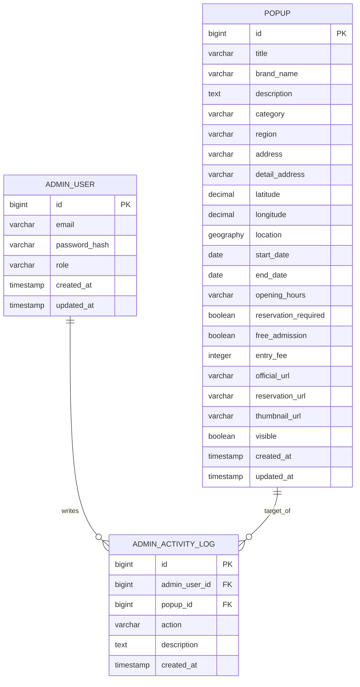

# Popup Map ERD

## Mermaid ERD



## 테이블 설명

### POPUP

팝업스토어의 핵심 정보를 저장한다.

| 컬럼 | 설명 |
| --- | --- |
| `id` | 팝업 ID |
| `title` | 팝업명 |
| `brand_name` | 브랜드명 |
| `description` | 소개 문구 |
| `category` | 카테고리 enum |
| `region` | 지역 enum |
| `address` | 주소 |
| `detail_address` | 상세 주소 |
| `latitude` | 위도 |
| `longitude` | 경도 |
| `location` | PostGIS 위치 컬럼 |
| `start_date` | 운영 시작일 |
| `end_date` | 운영 종료일 |
| `opening_hours` | 운영 시간 |
| `reservation_required` | 예약 필요 여부 |
| `free_admission` | 무료 입장 여부 |
| `entry_fee` | 입장료 |
| `official_url` | 공식 링크 |
| `reservation_url` | 예약 링크 |
| `thumbnail_url` | 대표 이미지 URL |
| `visible` | 공개 여부 |
| `created_at` | 생성 시각 |
| `updated_at` | 수정 시각 |

### ADMIN_USER

관리자 계정 정보를 저장한다.

| 컬럼 | 설명 |
| --- | --- |
| `id` | 관리자 ID |
| `email` | 로그인 이메일 |
| `password_hash` | 암호화된 비밀번호 |
| `role` | 관리자 권한 |
| `created_at` | 생성 시각 |
| `updated_at` | 수정 시각 |

### ADMIN_ACTIVITY_LOG

관리자 주요 작업 이력을 저장한다. PRD의 운영 요구사항 중 "주요 관리자 작업 추적"을 반영한 테이블이다.

| 컬럼 | 설명 |
| --- | --- |
| `id` | 로그 ID |
| `admin_user_id` | 작업한 관리자 ID |
| `popup_id` | 대상 팝업 ID |
| `action` | 작업 유형 |
| `description` | 작업 설명 |
| `created_at` | 생성 시각 |

## Enum

### category

```text
FASHION
BEAUTY
CHARACTER
FOOD
BAKERY
ART
LIFESTYLE
TECH
```

### region

```text
SEONGSU
HONGDAE
GANGNAM
HANNAM
JAMSIL
YEOUIDO
```

### role

```text
ADMIN
```

### admin_activity_log.action

```text
POPUP_CREATED
POPUP_UPDATED
POPUP_DELETED
POPUP_VISIBILITY_CHANGED
```

## 인덱스 권장

```sql
CREATE INDEX idx_popup_region ON popup (region);
CREATE INDEX idx_popup_category ON popup (category);
CREATE INDEX idx_popup_period ON popup (start_date, end_date);
CREATE INDEX idx_popup_visible_end_date ON popup (visible, end_date);
CREATE INDEX idx_popup_location ON popup USING GIST (location);
CREATE UNIQUE INDEX uk_admin_user_email ON admin_user (email);
```

## 설계 메모

- `POPUP.location`은 PostGIS 기반 경계 조회와 근처 조회를 위한 컬럼이다.
- `latitude`, `longitude`는 응답과 관리 화면 입력 편의를 위해 별도 컬럼으로 유지한다.
- `ADMIN_ACTIVITY_LOG`는 MVP 필수 CRUD에는 없어도 되지만, 운영 로그 요구사항을 만족하기 위해 포함했다.
- 이미지 업로드는 MVP 제외 범위이므로 별도 이미지 테이블 없이 `thumbnail_url` 단일 컬럼으로 시작한다.
- 추후 다중 이미지가 필요하면 `POPUP_IMAGE` 테이블을 추가한다.
